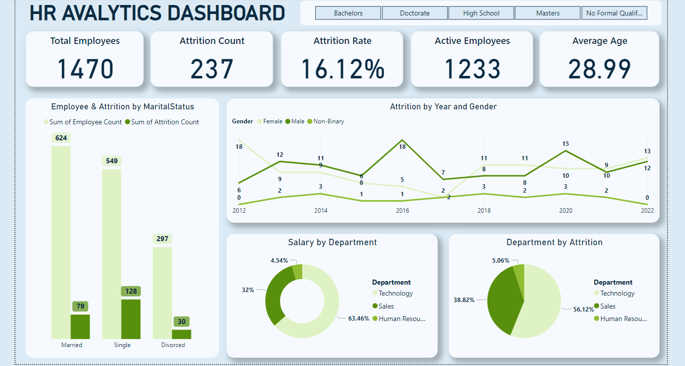
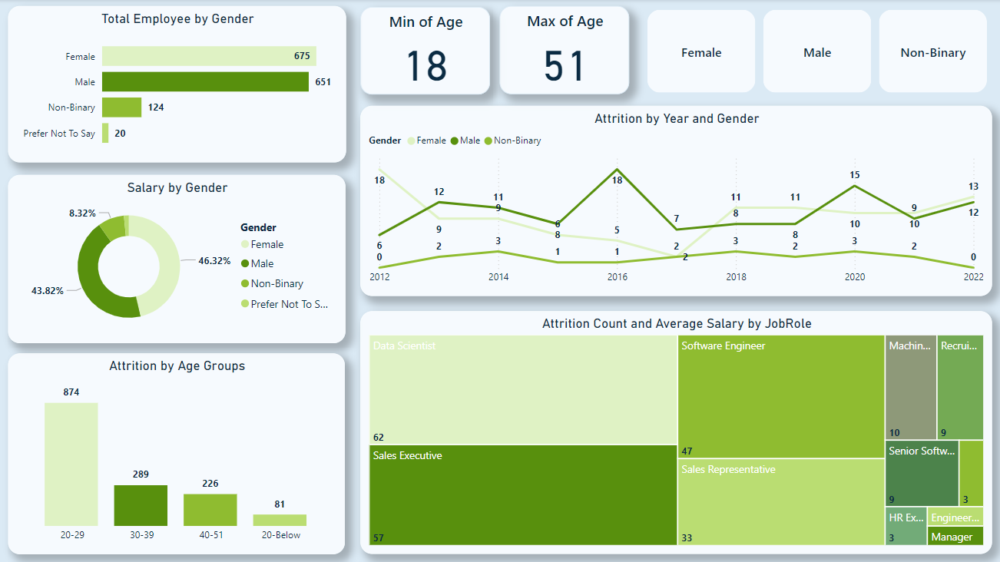
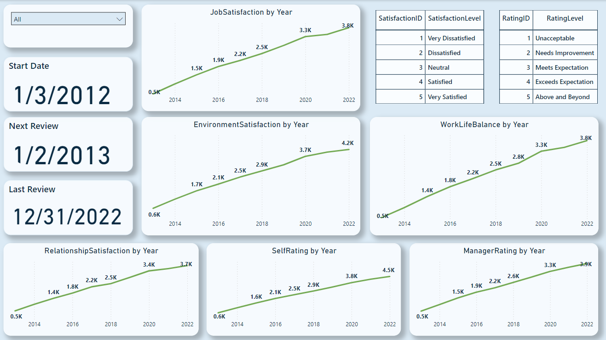
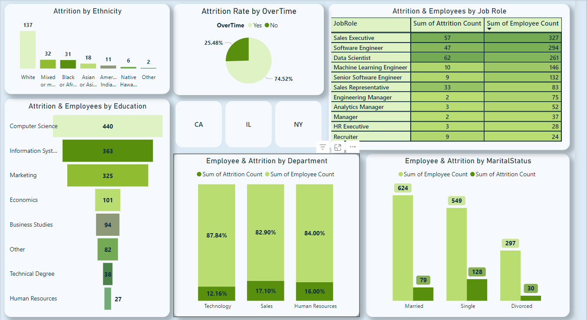

# Human-Resources-Dashboard-Power-BI
The dashboard is an interactive tool designed to display and analyze data visually, allowing for quick insights and pattern recognition. It provides a clear overview of key metrics, supporting data-driven decision-making and goal tracking to enhance strategic planning and execution within the organization.

# The interactive HR dashboard, built using Power BI

# Objective

Employee Data Analysis: • Objective: Extract and understand data related to recruitment, training, and performance levels. • Outcome: Enable management to make data-driven decisions regarding employees and increase operational efficiency.

Process Improvement: • Objective: Provide data-driven strategies to improve recruitment efficiency and employee retention. • Outcome: Increase employee retention rates and reduce costs associated with repeated recruitment.

Employee Performance Analysis: • Objective: Analyze performance data across different departments to identify high-performing employees and recognize patterns linked to productivity and efficiency. • Outcome: Improve evaluation and professional development processes, leading to overall increased productivity.

Employee Turnover Prediction: • Objective: Use predictive analytics in Python to develop a model that forecasts the likelihood of employees leaving their jobs, identifying the factors influencing resignations. • Outcome: Reduce turnover rates and develop proactive strategies to retain employees.

Diversity and Inclusion Analysis: • Objective: Evaluate employee demographic data to measure diversity within the organization and analyze inclusive patterns within teams to ensure fair representation in recruitment and promotion processes. • Outcome: Foster a diverse and inclusive work environment, improving performance through diversity.

Training Program Evaluation: • Objective: Analyze training data to assess the impact of training programs on employee performance and identify the most effective programs. • Outcome: Improve training programs and enhance employees' professional skills.

Employee Experience Improvement: • Objective: Analyze employee satisfaction data through surveys and key performance indicators to identify areas for improvement in the employee experience within the company.
• Outcome: Enhance job satisfaction and increase employee loyalty to the company. These objectives focus on improving human resource management through in-depth analysis of employee data, leading to better overall performance and more effective achievement of organizational goals.

# Questions (KPIS)

• What is the total number of employees in the company?
• What is the employee attrition rate for the company?
• How many active employees are currently in the company?
• What is the average age of the employees?
• How does the attrition rate differ between married, single, and divorced employees?
• Is there a difference in attrition rates between female, male, and non-binary employees over the years?
• Which department has the highest average salary, and which department has the lowest average salary?
• Which department has the highest attrition rate, and which department has the lowest attrition rate?

# Tools and Technologies Used

Tools and Technologies Used
This project leverages the following tools and technologies to deliver actionable insights and data-driven solutions:

Power BI
• Power Query: Utilized to clean, transform, and shape raw data into a structured format.
• DAX (Data Analysis Expressions): Applied advanced formulas and calculations to create meaningful metrics and KPIs.
• Data Modeling: Designed and optimized data relationships for efficient querying and reporting.

Microsoft Excel
• Power Query: Used for data transformation and pre-processing before importing into Power BI.

# Sales Overview Dashboard

Key Metrics and Insights
1. Total Employees:
   The organization employs 1,470 individuals.
2. Attrition Count and Rate:
   - Total Attrition Count: 237 employees.
   - Attrition Rate: 16.12%, highlighting the percentage of employees who have left the organization.
3. Active Employees:
   The current workforce includes 1,233 active employees.
4. Average Employee Age:
   The average age across the workforce is 28.99 years.
Detailed Visualizations
1. Employee & Attrition by Marital Status:
   - Married employees constitute the majority (624 employees), with 79 experiencing attrition.
   - Single employees follow with 549, and 128 of them left.
   - Divorced employees are the least represented (297 employees), with 30 in attrition.
2. Attrition by Year and Gender:
   - A detailed trend from 2012 to 2022 shows attrition rates categorized by gender: Female, Male, and Non-Binary.
   - Peaks in attrition are observed in 2016 and 2020, with notable gender-based differences.
3. Salary by Department:
   - Salaries are predominantly allocated to the Sales Department (63.46% of the total budget).
   - The Technology Department accounts for 32%, while Human Resources takes 4.54%.
4. Department by Attrition:
   - Most attrition occurred in the Sales Department (56.12%).
   - Technology and Human Resources experienced attrition rates of 38.82% and 5.06%, respectively.

1. Gender Distribution:
   - Female Employees: 675 employees.
   - Male Employees: 651 employees.
   - Non-Binary Employees: 124 employees.
   - Prefer Not to Say: 20 employees.
2. Age Range:
   - The minimum age in the workforce is 18 years.
   - The maximum age is 51 years.
3. Salary Distribution by Gender:
   - Male employees account for 46.32% of the total salary allocation.
   - Female employees receive 43.82% of the salaries.
   - Non-Binary employees make up 8.32% of the salary allocation.
   - Prefer Not to Say employees account for the remaining portion.
4. Active Employees by Department: 
   - Technology Department: The largest department with 828 active employees.
   - Sales Department: Comprises 354 active employees.
   - Human Resources: The smallest department, with 51 employees.
  
5. Attrition by Year and Gender:
   - Attrition trends from 2012 to 2022 are broken down by gender, with notable spikes in 2016 and 2020.
   - Female employees experienced higher attrition rates during peak years.
6. Attrition Count and Average Salary by Job Role:
   - The Data Scientist role shows the highest attrition count (62 employees).
   - Other notable roles with high attrition include Sales Executive (57 employees) and Software Engineer (47 employees).
   - Lower attrition is observed among Managers and HR Executives.

Key Metrics and Insights
Job Satisfaction by Year:
Shows a continuous improvement over the years, increasing from 0.5K employees in 2012 to 3.8K employees in 2022 expressing satisfaction with their jobs.
Environment Satisfaction by Year:

Reflects growth in positive perceptions of the workplace environment, with satisfaction rising from 0.6K in 2012 to 4.2K in 2022.
Work-Life Balance by Year:

Demonstrates significant improvement, starting at 0.5K employees in 2012 and reaching 3.8K employees in 2022, indicating enhanced balance between work and personal life.
Relationship Satisfaction by Year:

Indicates strong growth in satisfaction with workplace relationships, from 0.5K employees in 2012 to 3.7K employees in 2022.
Self-Rating by Year:

Tracks employee self-assessments, growing from 0.6K in 2012 to 4.5K in 2022, showcasing higher confidence and self-perceived performance levels.
Manager Rating by Year:

Highlights improved perceptions of managerial performance, increasing steadily from 0.5K employees in 2012 to 3.9K employees in 2022.
Rating Levels and Satisfaction Levels:

Satisfaction Levels are categorized from Very Dissatisfied (1) to Very Satisfied (5).
Rating Levels are categorized from Unacceptable (1) to Above and Beyond (5).

Key Metrics and Insights.

Attrition by Ethnicity.

White employees: 137 attritions, the highest among ethnic groups.

Other groups like Black/African American (31) and Asian/Asian American (18) exhibit significantly lower attrition counts.
Attrition Rate Over Time
Attrition Rate:
25.48% of employees have left the organization.
74.52% remain employed.
Attrition & Employees by Job Role
High Attrition Roles:
Data Scientist: 62 attritions (highest).
Sales Executive: 57 attritions.
Software Engineer: 47 attritions.
Low Attrition Roles:
Managerial and HR roles show minimal attrition counts (≤3).
Attrition & Employees by Education
Top Educational Backgrounds:
Computer Science: 440 employees, leading in both workforce size and attrition.
Information Systems: 363 employees.
Lowest Attrition:
Fields like Human Resources (27 employees) and Technical Degrees (38 employees).
Employee & Attrition by Department
Departmental Attrition Rates:
Technology: 12.16% attrition (87.84% retention).
Sales: 17.10% attrition.
Human Resources: 16.00% attrition.
Employee & Attrition by Marital Status
Attrition Trends:
Single employees: Highest attrition rate (128).
Married employees: Lower attrition count (79), with the largest workforce size (624).
Divorced employees: Minimal attrition (30).

